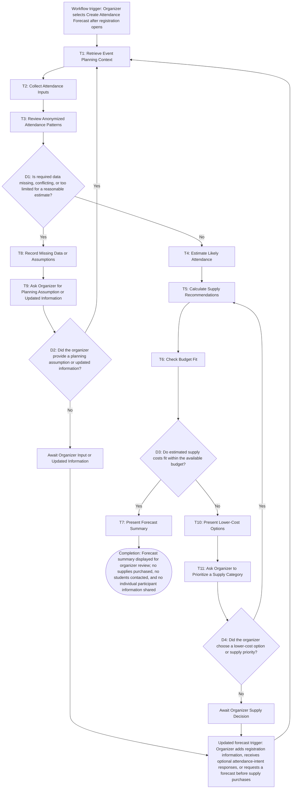

# Workflow of Tasks

*Replace all bracketed prompts with information specific to your proposed system. Delete instructional text that does not belong in your final specification. Add or remove task sections as needed. Every task shown in the general workflow must have a corresponding task specification below.*

## 1. Workflow Overview
### 1.1 Workflow Goal
This workflow supports the system goal defined in `my_first_agent/README.md`.

### 1.2 Workflow Trigger

A forecasting run begins when a CPVC AI Hackathon organizer selects Create Attendance Forecast after registration opens. An updated forecasting run begins when the organizer adds new registration information, receives new optional attendance-intent responses, or requests a new forecast before making supply purchases. An update uses the most current available data and does not contact students automatically.

### 1.3 Completion Condition at Runtime

The run is complete when HackTrack has reviewed the available registration, optional attendance-intent, and anonymized past-event data; created an evidence-based estimated attendance range; calculated recommended amounts of food, drinks, and swag within the stated budget; recorded any missing data or assumptions; and displayed the forecast summary for organizer review. Completion never means that supplies were purchased, students were contacted, or individual participant information was shared.
### 1.4 General Workflow

The system first performs T1: Retrieve Event Planning Context to load the event date, available budget, supply categories, current registration count, and any organizer-provided planning assumptions. It then performs T2: Collect Attendance Inputs, using current registration data and optional attendance-intent responses. T3: Review Anonymized Attendance Patterns compares available past event registration and check-in patterns to identify a reasonable expected attendance rate. The system uses aggregated or anonymized information and does not reveal an individual student’s attendance history.

Next, T4: Estimate Likely Attendance combines the current registration count, optional intent data, and past attendance patterns to create an expected attendance range. T5: Calculate Supply Recommendations converts that range into suggested quantities of food, drinks, and swag. T6: Check Budget Fit compares the estimated supply cost with the organizer’s available budget and identifies whether adjustments are needed. If the recommendations exceed the budget, the system presents lower-cost options or asks the organizer to choose which supply category should be prioritized; it does not make the decision on its own.

Finally, T7: Present Forecast Summary shows the organizer the expected attendance range, recommended supply quantities, assumptions, data limitations, and budget status. If required data is missing, conflicting, or too limited to make a reasonable estimate, HackTrack records the issue and asks the organizer for a planning assumption or updated information rather than guessing. The system does not purchase supplies, send messages to students, or expose personal participant data.

### 1.5 Workflow Diagram

[Insert a flowchart showing the tasks in sequence. Label each task with a task number and short name. Show decision branches, loops, review points, and possible stopping conditions. Below is an example of a Mermaid. You can either edit the mermaid below yourself or ask ChatGPT to generate a Mermaid script based on your workflow description above. Give every task a unique ID, such as T1, T2, and T3, and name tasks using a verb and an object in the mermaid.]

